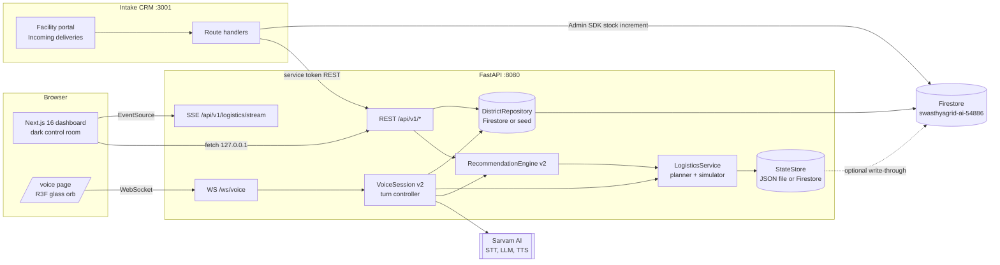

# SwasthyaGrid

A district health control room for Rajasthan. It forecasts medicine stock-outs, bed pressure and staffing risk across 40 facilities in 5 districts, turns those forecasts into ranked recommendations, moves approved recommendations onto a simulated truck fleet, and closes the loop when the receiving facility confirms delivery in a separate intake CRM. A bilingual voice agent (Hindi, Hinglish, English) answers questions grounded in the same data.

License: Apache 2.0 is the intended license; note that no `LICENSE` file is present in this checkout.

## Contents

1. [The problem](#the-problem)
2. [What is in this repository](#what-is-in-this-repository)
3. [Architecture](#architecture)
4. [Feature tour](#feature-tour)
5. [Voice agent](#voice-agent)
6. [Supply chain module](#supply-chain-module)
7. [Data provenance and attributions](#data-provenance-and-attributions)
8. [Running it on Windows](#running-it-on-windows)
9. [Environment variables](#environment-variables)
10. [Demo script](#demo-script-about-four-minutes)
11. [Testing and evaluation](#testing-and-evaluation)
12. [What the system decides and what it proposes](#what-the-system-decides-and-what-it-proposes)
13. [Known limitations](#known-limitations)
14. [Further reading](#further-reading)

## The problem

Across India's public healthcare system, more than 25,000 Primary Health Centres (PHCs) and 5,600 Community Health Centres (CHCs) provide frontline care. Operational data from these facilities often lives in paper registers, spreadsheets and monthly summaries. When a rural PHC runs out of Anti-Snake Venom, Anti-Rabies Vaccine, Oxytocin or Adrenaline, the district office can learn about it days after the stock reached zero, while a sibling facility a short drive away holds a surplus of the same item.

Health management information systems mostly record what went wrong last month. They do not forecast tomorrow's depletion or work out where stock should move. SwasthyaGrid computes stock burn rates and bed saturation ahead of time, proposes inter-facility and warehouse-to-facility movements with a confidence score and stated reasons, and requires a human approval before anything is dispatched.

## What is in this repository

| Part | Location | Port | Role |
|---|---|---|---|
| FastAPI backend | `backend/` | 8080 | Forecasting, recommendation engine, logistics simulator and planner, insights, voice WebSocket, typed Ask agent |
| Next.js dashboard | `frontend/` | 3000 | Control room UI: command centre, voice page, supply chain pages, district and facility drill-downs |
| Intake CRM | `ai-healthcare-crm/` | 3001 | Facility staff update stock and confirm incoming deliveries |

The CRM is a separate git repository (`SwasthyaGrid-CRM`, branch `feat/deliveries`) and is not part of this repository. Clone it next to the backend and dashboard checkout if you want to run the full delivery loop. Everything else in this README works without it.

## Architecture



In the current build the state store is the JSON file backend (`backend/.runtime/logistics_state.json`); the Firestore write-through shown as a dotted line is not implemented. The repository reads Firestore when it is reachable and configured, and otherwise reads the bundled seed data (see [Known limitations](#known-limitations)).

Architecture principles that carry over from the first version and still hold:

- Deterministic engines compute the numbers (days of cover, bed saturation, transfer quantities, confidence, status derivation). Language models explain and phrase; they do not decide.
- Every recommendation needs a human action (approve, modify or reject) before a shipment is created.
- The administrative agent and the voice agent use read-only tools.
- The dashboard keeps working when the backend is down: it shows fixture data and an offline banner.
- Security headers are applied by a pure ASGI middleware, so streaming responses (SSE) are not interfered with.

## Feature tour

The sidebar groups pages as follows. All pages are scope-aware: a global district scope (`all` or one of the five districts) is kept in the URL search parameter `d` (for example `/inventory?d=district_kota`) and restored from `localStorage`.

| Group | Page | Route | Notes |
|---|---|---|---|
| Command | Command Centre | `/command` | State KPIs, Rajasthan choropleth, district league table, facility by dimension heatmap, live trucks, AI briefing. `/` and `/overview` redirect here. |
| Command | Voice Control Room | `/voice` | Glass orb, live transcript, tool trace, fact cards, typed fallback |
| Command | Recommendations | `/recommendations` | Approve, modify, reject; shows the shipment an approval created |
| Districts | District Comparison | `/districts` | Side-by-side risk index and metrics |
| Districts | District Detail | `/districts/[districtId]` | Reached by drill-down, not in the sidebar |
| Districts | Facilities | `/facilities` | Filterable table with risk chips |
| Districts | Facility Profile | `/facilities/[facilityId]` | Reached by drill-down: stock, beds, staff, inbound shipments, causal chain |
| Districts | Geo Intelligence | `/map` | Leaflet map with district boundaries and facility markers |
| Supply Chain | Dispatch | `/supply` | Live map of all trucks, status chips, KPI overlay, volume chart |
| Supply Chain | Shipments | `/supply/shipments` | Filterable shipment list |
| Supply Chain | Shipment Tracking | `/supply/shipments/[shipmentId]` | ETA countdown, status stepper, driver card, cold-chain temperature, route on map |
| Supply Chain | Fleet | `/supply/fleet` | Vehicles with live status and cargo pallet view |
| Supply Chain | Drivers | `/supply/drivers` | Roster, live status, driver panel |
| Supply Chain | Load Planning | `/supply/planning` | Queue, capacity view, Gantt chart of trips |
| Supply Chain | Warehouses | `/supply/warehouses` | Stock, reservations, days of cover, expiry |
| Operations | Inventory | `/inventory` | Stock and days of cover by facility and medicine |
| Operations | Footfall | `/footfall` | Seven day patient volume forecast |
| Operations | Beds | `/beds` | Occupancy now and next week |
| Operations | Doctors | `/doctors` | Attendance and absence risk |
| Operations | Diagnostics | `/diagnostics` | Equipment status and failover |
| Insights | Analytics | `/analytics` | Cross-cutting charts and scenario views |

The dashboard also has a design system reference page at `/ds` (theme tokens and components), a dark theme by default with a light theme toggle, a command palette, and a topbar sim clock chip (1x, 10x, 60x, 120x and reset).

The typed Ask endpoint (`POST /api/v1/ask`, Gemini) remains. It works without a key in the sense that the rest of the product does; the AI answer returns a structured fallback when no key is set.

## Voice agent

The voice agent is a WebSocket endpoint (`/ws/voice`) in the backend. It uses Sarvam AI for all three stages:

- **Speech to text**: Sarvam realtime STT (`saaras:v3-realtime`) over a WebSocket, with server-side voice activity detection. Audio is PCM16, mono, 16 kHz, sent from the browser in roughly 100 ms frames.
- **Language model**: a Sarvam chat model with tool calling (`sarvam-105b-conversations` by default). Answers are streamed and split into sentences.
- **Text to speech**: Sarvam `bulbul:v3` over a WebSocket, streamed as 24 kHz PCM. If the socket fails mid-turn the remaining sentences of that turn fall back to REST synthesis.

Behaviour:

- **Streaming.** The answer is spoken sentence by sentence as the model produces it. A short filler line ("One moment, checking the data.") plays if a tool round is still running about one second after the end of speech.
- **Barge-in.** If the officer starts speaking while the assistant is thinking or speaking, the current turn is cancelled once the transcript shows at least two words (with a 400 ms guard after the first audio so the assistant's own voice does not interrupt it). The Stop button interrupts immediately.
- **Tools.** Thirteen read-only tools cover state and district briefings, facility lookup and status, shortages, district comparison, recommendations, shipments and single shipment tracking, fleet status, footfall forecast, causal chain and performance. Spoken names ("Kota ka PHC chaar", "rural fourteen", Devanagari names) go through fuzzy resolvers. The agent cannot approve, reject, dispatch or cancel anything.
- **Fact cards.** Each reply can carry structured cards (district summary, facility, shortages, ranking, shipments, shipment, fleet) that the voice page renders next to the transcript.
- **Grounding rule.** Facts about districts, facilities, stock, shipments and so on must come from a tool result in the same conversation. General knowledge (what ORS is used for, why vaccines need a cold chain) is allowed and presented as general guidance.
- **Orb.** A Three.js glass orb (react-three-fiber) reacts to microphone level and to assistant playback level: mint while listening, violet while speaking. It falls back to a CSS orb where WebGL is unavailable, and honours reduced motion.

Protocol details are in [`docs/v2-architecture.md`](docs/v2-architecture.md).

## Supply chain module

The supply chain is a deterministic simulation on top of real road geometry. It exists so that a recommendation has somewhere to go.

- **Master data.** 6 warehouses (one state central warehouse in Jaipur and one district drug warehouse per district), 31 vehicles in 5 classes (two of them refrigerated), 40 drivers, a 7-medicine catalogue with pack sizes, weights and cold-chain flags, 365 precomputed road routes, and 90 days of shipment history for charts.
- **Simulator.** An accelerated clock (default 60 simulated seconds per real second) drives a tick loop once per real second. A trip is a list of segments (load, drive, dwell, incident). Position, status and events are derived from the trip and the current sim time, so a restart reproduces the same history. Incidents (traffic, checkpost, tyre puncture and similar) and refrigerated-cargo temperature excursions are drawn from a seeded random source keyed on the shipment id.
- **Planner.** Picks the smallest adequate vehicle class, then a driver on shift with driving hours to spare, and reserves warehouse stock. Shipments that cannot be assigned stay queued with a readable reason (for example "No refrigerated vehicle free at DDW Kota until 15:40").
- **Statuses.** `recommended`, `approved`, `loading`, `in_transit`, `delayed`, `arrived`, `delivered`, `cancelled`. All but the last two stored ones are derived from the trip timeline.
- **Routes.** Road paths come from OSRM, precomputed into `backend/data/routes.json` by `backend/scripts/build_routes.py`. The app never calls OSRM at runtime.
- **Live updates.** `GET /api/v1/logistics/stream` is a Server-Sent Events stream with `tick` (vehicle positions, every second), `shipment`, `risk`, `recommendations` and `kpis` events. The dashboard opens it with `EventSource`.
- **Proof-of-delivery loop with the CRM.** When a truck reaches a facility the shipment becomes `arrived`. Facility staff open the CRM, see the incoming delivery, and confirm the received quantities. The CRM calls the backend (`POST /shipments/{id}/pod` with a service token), then increments stock in Firestore in a transaction, then tells the backend the stock was applied. The backend marks the shipment `delivered`, refreshes recommendations, and the dashboard shows the facility's risk dropping without a reload. The sequence is idempotent: a repeated confirmation changes nothing.

## Data provenance and attributions

All logistics, fleet, driver and shipment history data is simulated. The dashboard labels every supply page "Simulated operational data". No number about vehicles, drivers, warehouses, shipment volumes, on-time rates or delivery history is a real statistic about Rajasthan or any real agency. Warehouse names are generic. Registration plates use real Rajasthan RTO prefixes only to look plausible. Driver names are drawn from fixed lists. Facility, stock, bed, doctor and diagnostic rows are also generated (deterministic seeds, `backend/scripts/generate_districts.py` and `generate_logistics.py`) and describe 40 illustrative facilities.

What is real:

- **Routes.** Road geometry and durations: OpenStreetMap contributors, via the public OSRM demo server, fetched once and committed.
- **Boundaries.** District boundaries: geoBoundaries (ODbL 1.0), simplified ADM2 release for India. The Jaipur Rural district is drawn with the Jaipur district boundary and the map tooltip says so.
- **Map tiles.** Esri Canvas gray tiles by default (attribution "Tiles (c) Esri"). CARTO tiles are optional via `NEXT_PUBLIC_MAP_TILES=carto`. Both include OpenStreetMap contributors' data.

## Running it on Windows

These notes are for Git Bash or PowerShell on Windows 11. Requirements: Python 3.12 or newer, Node.js 20.9 or newer, and (for the CRM) a Firestore service account.

Two rules matter on this platform:

1. **Use `127.0.0.1`, not `localhost`.** On many Windows machines `localhost` resolves to `::1` first, and a browser WebSocket or EventSource does not fall back to IPv4. Every URL the browser dials must use `127.0.0.1`. The backend binds `0.0.0.0`.
2. **Use a production build for the dashboard.** `next dev` blocks HMR requests from the `127.0.0.1` origin, so run `npm run build` and then `next start`. `NEXT_PUBLIC_*` variables are inlined at build time: change one and you must rebuild.

### 1. Free the ports (optional)

```powershell
foreach ($p in 8080,3000,3001) { Get-NetTCPConnection -LocalPort $p -State Listen -ErrorAction SilentlyContinue |
  ForEach-Object { $id=$_.OwningProcess; Get-CimInstance Win32_Process | Where-Object { $_.ProcessId -eq $id -or $_.ParentProcessId -eq $id } |
    ForEach-Object { Stop-Process -Id $_.ProcessId -Force -ErrorAction SilentlyContinue } } }
```

Bash `kill` does not reliably stop Windows processes, and a `uvicorn --reload` child can keep its socket after the parent exits, so use this snippet.

### 2. Backend (port 8080)

```bash
cd backend
python -m venv .venv
source .venv/Scripts/activate        # PowerShell: .\.venv\Scripts\Activate.ps1
pip install -r requirements.txt
cp .env.example .env                 # then fill in the keys you have; all are optional
python -m uvicorn app.main:app --host 0.0.0.0 --port 8080
```

With no keys the backend runs entirely on the bundled seed data. OpenAPI docs are at `http://127.0.0.1:8080/docs`. Logistics state is written to `backend/.runtime/` (ignored by git); delete that folder, or call `POST /api/v1/logistics/admin/reset`, to start the scenario again.

### 3. Dashboard (port 3000)

Create `frontend/.env.local` (see the variable table below), then:

```bash
cd frontend
npm install
npm run build
npx next start -p 3000
```

Open `http://127.0.0.1:3000`. Stop any running `next dev` before `next build`, and do not delete `.next` while a dev server is running.

### 4. CRM (port 3001, separate repository)

```bash
cd ai-healthcare-crm
npm install
npm run dev            # dev script is `next dev -p 3001`
```

The CRM needs `FIREBASE_SERVICE_ACCOUNT`, `SESSION_SECRET`, `SWASTHYAGRID_API_BASE` and `SWASTHYAGRID_SERVICE_TOKEN` in its `.env.local`. The service token must equal the backend's `LOGISTICS_SERVICE_TOKEN`. Generate one with `python -c "import secrets; print(secrets.token_urlsafe(32))"`. Do not paste it into chat, logs or commits.

### 5. Health checks

```bash
curl -s -o /dev/null -w "%{http_code}\n" http://127.0.0.1:8080/health
curl -s -o /dev/null -w "%{http_code}\n" http://127.0.0.1:3000/command
curl -s -o /dev/null -w "%{http_code}\n" http://127.0.0.1:3001/
curl -N --max-time 3 http://127.0.0.1:8080/api/v1/logistics/stream      # should print "event: tick"
```

Start each server in its own command; chaining `sleep` and `curl` in the same command that launches a background server can hang the shell.

## Environment variables

None of the values below are real. Never commit `.env*` files. `backend/.env`, `frontend/.env.local` and the CRM's `.env.local` are gitignored.

### `backend/.env`

`backend/.env.example` lists every key with an empty value.

| Key | Default | Purpose |
|---|---|---|
| `GEMINI_API_KEY` | none | Typed Ask agent |
| `SARVAM_API_KEY` | none | Voice STT, LLM, TTS and the AI briefing |
| `SARVAM_CHAT_MODEL` | `sarvam-105b-conversations` | Voice and briefing model |
| `SARVAM_STT_MODEL` | `saaras:v3-realtime` | Realtime STT |
| `SARVAM_TTS_MODEL` | `bulbul:v3` | TTS |
| `SARVAM_SPEAKER` | `simran` | TTS voice |
| `SARVAM_TTS_MODE` | `ws` | TTS transport, `ws` or `rest` |
| `SARVAM_STREAM_WITH_TOOLS` | `true` | Single streaming planning call that can carry tool calls |
| `DATA_SOURCE` | `auto` | `auto`, `seed` or `firestore` |
| `FIREBASE_SERVICE_ACCOUNT` | none | Base64 or raw service-account JSON for Firestore |
| `FIREBASE_SERVICE_ACCOUNT_FILE` | none | Alternative: path to a service-account JSON file |
| `LOGISTICS_TIME_SCALE` | `60` | Simulated seconds per real second (`1` is real time) |
| `LOGISTICS_SCENARIO_START` | none | Fixed scenario start; otherwise today 08:30 IST at first boot |
| `LOGISTICS_AUTO_POD_MINUTES` | `240` | Auto-confirm routine and restock shipments after arrival; `0` disables |
| `LOGISTICS_BACKGROUND_TRAFFIC` | `true` | Generate routine and restock shipments |
| `LOGISTICS_TICK` | `true` | Tick loop and SSE (tests set `false`) |
| `LOGISTICS_ADMIN_ENABLED` | `true` locally | Time scale and reset endpoints |
| `LOGISTICS_SERVICE_TOKEN` | none | Shared secret for CRM proof-of-delivery calls; POD returns 503 when empty |
| `LOGISTICS_STATE_PATH` | `.runtime/logistics_state.json` | JSON state store |
| `CORS_ORIGINS` | localhost and 127.0.0.1 on ports 3000 and 3001 | Allowed origins |
| `CORS_ORIGIN_REGEX` | `http://(localhost\|127\.0\.0\.1):30\d\d` (unset in production) | Dev origins, used by CORS and the voice origin check |
| `ENVIRONMENT` | `local` | `production` disables admin endpoints and the dev origin regex |

### `frontend/.env.local`

| Key | Example | Purpose |
|---|---|---|
| `NEXT_PUBLIC_API_BASE` | `http://127.0.0.1:8080` | REST and SSE base (IPv4 on purpose). Inlined at build time. |
| `NEXT_PUBLIC_VOICE_WS_URL` | `ws://127.0.0.1:8080/ws/voice` | Voice socket. Inlined at build time. |
| `NEXT_PUBLIC_MAP_TILES` | `esri` | `esri` (default) or `carto`. Inlined at build time. |
| `GEMINI_API_KEY` | none | `/api/public-ask` only (server side) |

### `ai-healthcare-crm/.env.local`

| Key | Example | Purpose |
|---|---|---|
| `FIREBASE_SERVICE_ACCOUNT` | none | Admin SDK credentials |
| `SESSION_SECRET` | none | Session JWT signing |
| `SWASTHYAGRID_API_BASE` | `http://127.0.0.1:8080` | Backend base for server-to-server calls |
| `SWASTHYAGRID_SERVICE_TOKEN` | same as backend `LOGISTICS_SERVICE_TOKEN` | Proof-of-delivery authentication |

## Deploying the backend to Cloud Run (Always Free tier)

The frontend at `swasthyagrid.vercel.app` deploys automatically on every push to `master` through Vercel's own Git integration. The backend deploys to Cloud Run with `backend/scripts/deploy.sh`:

```bash
cd backend
GCP_PROJECT_ID=<your project> bash scripts/deploy.sh
```

The script builds the image with Cloud Build, pushes it to Artifact Registry, and deploys to Cloud Run in `us-central1` with `--min-instances 0 --max-instances 1`, so it never bills outside the Always Free tier limits (2 million requests, 180,000 vCPU-seconds and 360,000 GiB-seconds a month, us-central1/us-east1/us-west1 only). It expects three Secret Manager secrets already created: `gemini-api-key`, `sarvam-api-key`, `logistics-service-token`.

**The trade-off of staying free.** Scale to zero means Cloud Run can recycle the single instance whenever it is idle. Because the logistics simulator's state lives in memory, a cold start resets the scenario to 08:30 IST with a fresh set of shipments, and any open SSE stream or voice WebSocket is dropped when the instance is recycled under it. The dashboard and voice page reconnect automatically. This is a fine trade-off for a demo you drive live; it is not a substitute for a real state store if the backend needs to stay in sync over a long period untouched.

## Demo script (about four minutes)

At the default 60x clock the full loop fits in roughly four minutes.

1. `/command`: "Forty facilities across five districts. Ten are critical right now; the map and the matrix show where and why." Hover the Kota district and open its row in the league table.
2. Topbar voice button, `/voice`: ask "Kota mein abhi kya haal hai?" Point out the orb colour change, the streamed Hinglish answer, the "Checking Kota district data" trace and the fact card.
3. Ask "Which district needs attention first, and why?" in English, then interrupt mid-answer by speaking. The orb and the audio stop.
4. `/recommendations`: approve the critical ARV replenishment for the Kota facility. A toast appears and a shipment chip shows up.
5. `/supply`: the new shipment is `loading` at DDW Kota and then leaves. Other trucks move across the state and delayed shipments are orange.
6. Open the tracking page: ETA countdown, stepper, driver and reefer temperature.
7. Back on voice: "ARV Kota ki PHC tak kab pahunchegi?" returns the live ETA.
8. Raise the sim clock chip to 120x until the shipment is `arrived`.
9. CRM at `http://127.0.0.1:3001`, logged in as that PHC (or as `phc-rural-14` for the pre-arrived scenario shipment): open "Incoming deliveries" and confirm receipt.
10. Dashboard: a live toast reports the risk improving from Critical, and the KPIs and map update without a reload. Close on the AI briefing card.

Step 9 needs a CRM login for the receiving facility. See [Known limitations](#known-limitations) for which logins exist.

## Testing and evaluation

Current counts at the time of writing: 348 backend tests and 272 frontend tests.

```bash
# backend (from backend/, venv active)
python -m ruff check .
python -m pytest -q                          # 348 tests; DATA_SOURCE=seed is the safe default

# frontend (from frontend/, stop any dev server first)
npm run lint
npm run typecheck
npm run test                                 # vitest, 272 tests
npm run build
npm run gen:api                              # regenerate OpenAPI types from a running backend
```

Playwright end-to-end specs live under `frontend/e2e` (`c5/no-raw-ids.spec.ts`, `f1/command.spec.ts`, `f1/recommendations.spec.ts`, `f2/pages.spec.ts`). Run them with `npm run e2e` against a running backend and a production frontend build. The `e2e/voice` and `e2e/d1`, `e2e/d2` folders hold live-gate and screenshot scripts run with `node`.

Voice evaluation and latency (these call the paid Sarvam API):

```bash
cd backend
python -m evals.voice_eval                   # 40 cases, real Sarvam chat, text-only turns
python -m evals.voice_latency_probe          # opens the real WebSocket, 5 typed turns with TTS
```

Endpoint sweep, which times every GET endpoint against a running backend and exits non-zero if one fails or is slow:

```bash
python scripts/endpoint_sweep.py --base http://127.0.0.1:8080
```

Unit and integration tests never call Sarvam. Live calls happen only in the two evaluation commands above.

## What the system decides and what it proposes

| Concern | Deterministic engine | Language model |
|---|---|---|
| Days of cover, stock-out risk | Decides | Never |
| Bed occupancy risk | Decides | Never |
| Transfer and replenishment candidates, quantities, priority | Decides | Never |
| Recommendation confidence score | Decides | Never |
| Shipment status, position and ETA | Derived from the simulated trip | Never |
| Approve, modify, reject | Requires a human | Never |
| Briefings, Ask answers, spoken answers | Supplies numbers through tools | Phrases the answer |

Language models never change state. The voice agent is read-only by design.

## Known limitations

- **All logistics data is simulated.** Fleet, drivers, warehouses, shipment history, on-time rates and incidents are generated. Facility stock, beds, doctors and diagnostics are also generated seed data. None of it is a real statistic.
- **Firestore is not seeded with the 40 facilities.** The upsert of the 40-facility dataset into Firestore and the creation of 40 facility logins in the CRM were not applied, because both write to a live database and need explicit approval. The backend therefore runs with `DATA_SOURCE=seed`. In that mode the backend applies delivered stock itself (a stock overlay) and returns `stock_applied_by: "backend_overlay"`. The CRM only has its earlier logins (for example `phc-rural-14`, `phc-sector-12`, `chc-east` and the district admin), so a facility-specific CRM demo works today only for those facilities.
- **The CRM loop was verified against mocks and fakes.** The CRM's own tests use a fake Firestore and a mock backend. The end-to-end loop with a real Firestore, a real service token and a browser depends on the state of your Firestore data.
- **Voice audio was verified by frame counts, not by ear.** The automated live gate confirms that PCM audio frames arrive, are scheduled for playback, and that Stop halts playback within a millisecond or so of the click. Nobody listened to the audio as part of the build, so voice quality, pronunciation of Hindi and Hinglish text, and echo behaviour on real speakers are untested. The glass orb was measured at about 144 fps in a headed browser on an integrated GPU; headless browsers use software WebGL and are far slower.
- **Voice evaluation results.** Full details are in `docs/v2-reports/final-audit.md`. The latest full run of the 40 case evaluation scored 37 of 40. Two of the three misses were a too strict test (the model resolved the spoken name with `get_facility_status` instead of `find_facility`) and one was a real ungrounded answer to a Hindi question, which led to a stricter prompt rule; those three cases pass on a targeted rerun, but a second full run has not been made. Latency over five typed turns: 836 ms median to first audio without tools and 1.25 s with tools, which meets two of the three plan targets and misses the third (first audio of any kind on tool turns, 1.2 s) by 49 ms. Latency depends on Sarvam response times and varies between runs.
- **Performance remediation.** An earlier build froze under sustained running because the planner rebuilt fleet state for every queued shipment on every tick and background traffic never stopped. It now uses an active set (terminal shipments leave per-tick work), a planner pass that is built once and throttled (at most every 5 real seconds, top 25 queued by priority), a bound of 6 unassigned routine shipments per district with auto-cancel of stale routine and restock loads after 3 sim hours, throttled saves with an archive file, `tick_ms` metrics on `/metrics`, and an automatic scenario reset when a saved state is more than 3 sim days ahead or holds more than 1,500 shipments. A 10 minute soak at 120x showed tick p95 under 8 ms. A longer soak has not been run, and the planner cap can starve lower priority loads while 25 blocked loads sit ahead of them.
- **No lateral transfers on the seed data.** A district warehouse van must drive to the source facility first, so a lateral transfer never beats a direct warehouse replenishment by the required 30 minutes. The lateral path exists and is tested but does not appear in the demo data.
- **State is in one process.** Logistics state lives in memory with a JSON file behind it. Running several backend instances would give each its own world. If you deploy the backend to Cloud Run, use `--max-instances 1`. The v2 build has only been run locally; it is not deployed. The earlier Vercel and Cloud Run deployment predates v2.
- **CARTO tiles** showed a watermark without a key during testing, so Esri is the default.
- **OSRM routes** are from the public demo server. All 365 routes fetched successfully, none are synthetic.

## Further reading

- [`docs/v2-architecture.md`](docs/v2-architecture.md): logistics domain model and voice pipeline, for engineers joining the project.
- `docs/v2-reports/`: per-lane build reports, including deviations from the plan.
- `docs/v2-shots/`: screenshots of the built pages.
- `docs/00-vision.md` to `docs/10-demo-script.md`: the original v1 design documents. Parts of them describe the earlier single-district prototype.
