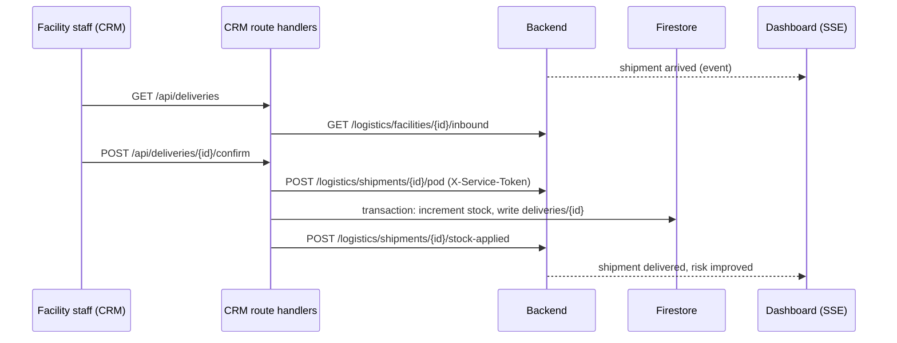

# SwasthyaGrid v2 architecture

This document is for an engineer joining the project. It covers two subsystems in the backend: the logistics domain (simulator, planner, recommendations, proof of delivery) and the voice pipeline. For the product overview and run book, see the root `README.md`. For per-task deviations from the original build plan, see `docs/v2-reports/`.

Constants quoted here were checked against the code at the time of writing. When you change one, update this file.

## 1. Logistics domain

Code lives in `backend/app/logistics/`. The main pieces:

| File | Responsibility |
|---|---|
| `models.py` | Pydantic models: `Shipment`, `TripPlan`, `Segment`, `PodRecord`, `Vehicle`, `Driver` |
| `clock.py` | `SimClock`, the accelerated simulation clock |
| `sim.py` | Pure functions: `build_trip`, `derive_status`, `position`, `derive_events` |
| `planner.py` | Vehicle and driver assignment for a shipment |
| `scenario.py` | Initial scenario and background traffic |
| `service.py` | `LogisticsService`: state, tick loop, approvals, cancel, proof of delivery |
| `store.py` | JSON file state store with atomic writes and an archive file |
| `stream.py` | `StreamHub` and `sse_events` for the SSE endpoint |
| `analytics.py` | KPIs and chart series from history plus live state |
| `roads.py`, `polyline.py` | Route lookup, polyline decoding and geometry |
| `master.py`, `catalog.py` | Loaders for warehouses, vehicles, drivers and the medicine catalogue |

The recommendation engine is in `backend/app/services/recommendation_service.py`. It creates the draft shipments that the logistics service plans.

### 1.1 Data and time

Reference data is generated deterministically (fixed seeds) and committed under `backend/data/`:

- `seed_districts.json`: 5 districts, 40 facilities, stock, beds, doctors, diagnostics.
- `seed_logistics.json`: 6 warehouses, 31 vehicles, 40 drivers, warehouse stock.
- `seed_logistics_history.json`: 90 days of shipment history (read-only; never mixed into live state, but analytics read both).
- `medicine_catalog.json`: 7 medicines with unit, weight, carton and pallet sizes, cold-chain and emergency flags, base daily consumption.
- `routes.json`: 365 road routes from OSRM, keyed `"{origin_id}->{dest_id}"`, each with `distance_m`, `duration_s` and a polyline. The planner never builds a trip for a pair missing from this file, and the app never calls OSRM at runtime.

All datetimes are ISO-8601 UTC with a trailing `Z` on the wire. The UI renders them in `Asia/Kolkata`.

`SimClock` maps real time to simulation time: `sim_now = anchor_sim + (real - anchor_real) * scale`. The default scale is 60 (`LOGISTICS_TIME_SCALE`). Changing the scale re-anchors the clock so time does not jump. The world pauses while the server is down: the store persists `last_sim_now` and, on boot, the clock resumes from it. Tests inject a fake clock and call `LogisticsService.tick(now)` directly instead of sleeping.

### 1.2 The shipment model

A `Shipment` carries an origin (always a warehouse for the truck's start), ordered `stops`, a destination facility, one or more `lines` (medicine, units, cartons, weight, pallet slots, cold-chain flag), a priority (`critical`, `high`, `normal`), a `kind`, a stored `status`, approval and cancellation fields, an optional `TripPlan`, an optional `blocked_reason`, and an optional `PodRecord`.

Kinds:

- `replenishment`: district warehouse (or central warehouse) to a facility.
- `lateral_transfer`: a district warehouse vehicle drives to a source facility, picks up (15 minute dwell), then drives to the target facility. Two drive legs.
- `routine`: background traffic, auto-approved by `system: routine schedule`.
- `restock`: central warehouse to a district warehouse.

Derived quantities per line: `cartons = ceil(units / units_per_carton)`, `weight_kg = units * unit_weight_kg + cartons * 1.0` (1 kg packaging per carton), `pallet_slots = max(1, ceil(cartons / cartons_per_pallet))`. A shipment's weight and pallet slots are sums over lines, and it is cold-chain if any line is.

Ids are `SHP-2` followed by a five digit sequence (for example `SHP-200123`). History ids start `SHP-1`.

### 1.3 Trip segments and derived state

A `TripPlan` is a list of `Segment`s, each with a `kind` (`load`, `drive`, `dwell`, `incident`), start and end times, and for drives a `route_key` plus `from_fraction` and `to_fraction` (an incident splits one drive into two halves).

`build_trip` constructs the timeline:

1. `load` at the origin: `12 + 6 * pallet_slots` minutes, capped at 45.
2. One `drive` per leg. Duration is the route's OSRM duration times a vehicle class speed factor (van 1.25, light truck 1.35, reefer van 1.30, medium truck 1.50, reefer truck 1.45) times a traffic factor (1.2 for IST hours 9, 10, 17, 18 and 19 at the start, else 1.0). A pickup stop adds a 15 minute `dwell`.
3. Incident: with probability 0.18, one drive is split at a point between 0.25 and 0.8 and an `incident` segment of 12, 18, 25, 40 or 55 minutes is inserted, with a reason such as "Traffic congestion" or "Checkpost inspection".
4. `planned_arrival` is the end of the last drive without the incident. `projected_arrival` includes it.
5. Reefer excursion: for cold-chain loads, with probability 0.05, a 14 minute window starting at 40% of drive time in which temperature rises to about 9.2 C.

Randomness comes from a generator seeded by a hash of the shipment id, with draws in a fixed order (incident first, then excursion). The same shipment id always produces the same trip. Because trips are stored and events are derived, a restart reproduces exactly the same history.

**Status is derived, not stored**, except for `delivered` and `cancelled`. `derive_status(shipment, t)` evaluates in order:

1. Stored `delivered` or `cancelled`: that status.
2. No `approved_at` (or approved in the future): `recommended`.
3. No trip, or `t` before `planned_start`: `approved` (queued or scheduled; `blocked_reason` says why if queued).
4. `t` inside the `load` segment: `loading`.
5. `t` inside an `incident` segment: `delayed`.
6. `t` inside any other segment: `delayed` if `projected_arrival` exceeds `planned_arrival` by more than 10 minutes, otherwise `in_transit`.
7. After the last segment: `arrived`, waiting for proof of delivery.

`position(shipment, t)` decodes the route polyline once (cached with cumulative distances), computes the fraction along the current drive with a quadratic ease near the ends so a truck does not jump to full speed, and interpolates latitude, longitude and bearing. Outside a drive the vehicle sits at the node or incident point with speed 0. Reefer temperature is `4.6 + 0.5 * sin(minutes / 17)` with a linear rise through any excursion window.

`derive_events(shipment, t)` returns every timeline event with `at <= t`: created, approved, vehicle assigned, loading started, departed, arrived at pickup, departed pickup, incident started and cleared, cold chain breach and recovery, arrived, POD confirmed, cancelled.

Auto proof of delivery applies only to `routine` and `restock` shipments, after `LOGISTICS_AUTO_POD_MINUTES` (default 240 simulated minutes; 0 disables). Replenishments and lateral transfers wait indefinitely for the facility's confirmation, because at 60x a person could not log in and confirm within a short simulated window.

### 1.4 Planner rules

`planner.assign(shipment, now, fleet_state)` returns a `TripPlan` or a readable blocked reason.

1. **Origin.** Replenishment and lateral shipments use the district drug warehouse (DDW) of the destination's district. Restock uses the central warehouse. If the DDW lacks stock for any line after reservations, the origin becomes the central warehouse.
2. **Vehicle candidates.** Same home warehouse as the origin; not in `maintenance`; no trip overlapping the new window (`planned_start` to `projected_arrival` plus a 30 minute return buffer); enough capacity in kg and pallet slots; refrigerated if the shipment is cold-chain.
3. **Vehicle choice.** Smallest adequate class (least spare capacity); ties broken by fewer km today, then id.
4. **Driver candidates.** Same home warehouse; planned start inside the driver's shift (shifts that cross midnight are handled); driving hours today plus the trip's drive hours at most 9; no overlapping trip. Highest rating wins; ties by id.
5. **Start time.** The latest of now plus 5 minutes, the vehicle's free time and the driver's shift start. If the only obstacle is the crew, the planner retries at later shift starts and driver release times on the same IST day. A busy vehicle returns a blocked reason instead, for example "No refrigerated vehicle free at DDW Kota until 15:40".
6. **Retry.** Queued shipments are retried in priority order (`critical`, `high`, `normal`, then `created_at`).

Warehouse stock is reserved when a shipment is approved, decremented on departure and released on cancellation.

Performance guardrails (added after a soak test froze an earlier build):

- Shipments that are `delivered` or `cancelled` leave an active set and cost nothing per tick. Terminal shipments older than 24 simulated hours move from the live state file to `logistics_archive.jsonl` next to it.
- A planner retry pass builds fleet state once with per-vehicle and per-driver busy intervals, tries at most 25 queued shipments (by priority), and runs at most once every 5 real seconds unless a shipment was just approved or one became terminal. The API's `POST /planner/run` still runs immediately.
- Background traffic skips a district that already has 6 unassigned routine shipments. A `routine` or `restock` shipment still without a trip 3 simulated hours after approval is cancelled with reason "No capacity, superseded". Replenishments and lateral transfers are never auto-cancelled.
- State is saved when dirty and at most every 5 real seconds (30 seconds when only the clock changed).
- `GET /metrics` reports `tick_ms` (last and p95), `queued`, `active`, `shipments_live` and `shipments_archived`. A tick above 200 ms logs a warning.
- On boot, if the saved `last_sim_now` is more than 3 simulated days past the scenario start, or the file holds more than 1,500 shipments, the file is backed up and the initial scenario is rebuilt.

### 1.5 Recommendations and the state machine

The engine produces four types: `replenishment`, `stock_transfer` (lateral, intra-district only), `bed_redirect` and `staff_transfer`.

Stock logic runs per facility and medicine row:

- Trigger when `days_remaining < reorder_threshold_days` (default 5). A zero consumption rate is treated as 0.1 to avoid division by zero.
- Priority: `critical` if days remaining is under 3, or the medicine is an emergency medicine and days remaining is under 5; `high` under 4; otherwise `normal`.
- Replenishment quantity brings the facility to 21 days of cover. Lateral quantity brings it to 7 days, limited to the source's surplus above 14 days of its own cover. Surplus is reserved in a working copy so two targets cannot draw the same units.
- Lateral candidates are in the same district, within 40 km by road, and are chosen only for `critical` priority when the lateral ETA beats the DDW ETA by more than 30 minutes. Otherwise the recommendation is a replenishment from the DDW, or from central if the DDW is short.
- Confidence is `clamp(round(0.5 * forecast_confidence + 25 * (1 - min(distance_km, 60) / 60) + (10 if emergency) + (10 if demand factors)), 40, 98)`.
- Bed redirects target the nearest CHC by road in the same district with next-week occupancy under 85%. Staff transfers source a healthy or monitor facility in the same district with a low-risk doctor. If none exists there is no recommendation.

Ids are stable: `"rec_" + sha1("{type}|{source_id}|{target_id}|{subject}")[:8]`, suffixed `_2`, `_3` for a later episode of the same key after a terminal one.

The status machine (`LEGAL_TRANSITIONS` in the service):

```
pending  -> approved | modified | rejected | expired
approved | modified -> dispatched | cancelled
dispatched -> fulfilled | cancelled
```

`rejected`, `expired`, `fulfilled` and `cancelled` are terminal. Any other transition is a 409, and an unknown id is a 404. The logistics service drives the later transitions: a shipment departing marks its recommendation `dispatched`, a delivered shipment marks it `fulfilled`, a cancelled shipment marks it `cancelled`.

`refresh(now)` runs on boot, when the repository version changes, after stock is applied for a delivery, and at most once per 60 real seconds from the tick loop. It recomputes candidates: pending records no longer produced become `expired` ("Condition cleared"), new candidates are added as `pending`, and non-pending records are never touched. A suppression window (120 simulated minutes) stops a new recommendation for a `(target facility, medicine)` pair that just received a delivery, in case the stock write is still propagating.

For every pending stock recommendation there is exactly one draft shipment with status `recommended`. Rejecting or expiring the recommendation cancels its draft. Approving or modifying it converts the draft: `approved_at` and `approved_by` are set, quantities come from `quantity_override` if given, and the planner runs.

### 1.6 Stock overlay and the CRM increment

Stock exists in two places depending on the data source, and exactly one of them is applied.

- **Seed mode** (`DATA_SOURCE=seed`, or Firestore unreachable). The repository serves the seed JSON. When a proof of delivery is recorded the backend keeps a `stock_overlay` entry per received line and `DistrictRepository.medicine_stock_for` adds those units on top of the seed rows (creating a row, with catalogue base consumption and a 5 day threshold, for a medicine the facility did not stock). The backend then refreshes recommendations immediately. The POD response says `stock_applied_by: "backend_overlay"`.
- **Firestore mode.** The repository ignores the overlay, because the CRM increments Firestore itself. The backend does not refresh at POD time (the stock is not in Firestore yet). The CRM calls `POST /shipments/{id}/stock-applied` after its transaction commits, which resets the repository cache and refreshes recommendations. The POD response says `stock_applied_by: "crm"`.

The CRM is the only writer of stock in Firestore. The backend never writes stock there.

If the `stock-applied` call fails in Firestore mode, the normal 20 second repository cache TTL and the 120 minute suppression window still prevent a phantom repeat recommendation.

### 1.7 Proof of delivery and idempotency



Idempotency exists at three levels:

1. **Backend POD.** `confirm_pod` returns `already_confirmed: true` and changes nothing if the shipment already has a POD. Otherwise it requires the derived status to be `arrived` and the `facility_id` to equal the destination, and raises 409 if not. The token is compared with `hmac.compare_digest`; a bad token is 401 and an unset `LOGISTICS_SERVICE_TOKEN` is 503.
2. **CRM transaction.** The transaction reads `deliveries/{shipment_id}`. If it exists the transaction does nothing. Otherwise it increments each `medicine_stock` row with `FieldValue.increment` (creating a row when missing) and writes the marker document. A retry after a partial failure therefore completes the increment exactly once. If the backend reports `already_confirmed`, the CRM applies the backend's stored POD figures rather than the new request body.
3. **`stock-applied`.** Idempotent; 404 for an unknown shipment and 409 if no POD has been recorded.

A `pod_id` (a UUID from the CRM) is stored on the `PodRecord` as the idempotency key of record.

### 1.8 The stream

`GET /api/v1/logistics/stream` is Server-Sent Events. A single tick loop computes a snapshot once per real second and fans it out through `StreamHub` to one bounded queue per client (200 entries). A slow client loses old `tick` frames only. `shipment`, `risk`, `recommendations` and `kpis` events are never dropped.

Events: `tick` (`sim_now` and vehicle positions, every second), `shipment` (each newly derived event), `risk` (a facility's risk level changed), `recommendations` (added, expired, changed ids), `kpis` (every 5 seconds). A comment heartbeat goes out every 15 seconds.

Test `sse_events` directly (subscribe, call `service.tick(t)`, `await anext(gen)`). Do not read the SSE route through a Starlette `TestClient`; it buffers the whole body and an infinite stream hangs the test. The security headers middleware is a pure ASGI class for the same reason: `BaseHTTPMiddleware` interferes with streaming and disconnect detection.

## 2. Voice pipeline

Code lives in `backend/app/voice/`, `backend/app/tools/` and `backend/app/api/v1/voice_ws.py`. The browser side is `frontend/src/lib/voice/` plus the orb components.

| File | Responsibility |
|---|---|
| `voice_ws.py` | The `/ws/voice` endpoint, origin check, frame dispatch |
| `session.py` | `VoiceSession`: one per socket, owns history, STT, TTS and `run_turn` |
| `turns.py` | `TurnController`: at most one active turn, coalescing, barge-in |
| `sarvam_stt.py` | Realtime STT WebSocket client |
| `sarvam_chat.py` | Non-streaming and streaming chat completions |
| `sarvam_tts_ws.py`, `sarvam_tts.py` | Streaming TTS over WebSocket, REST fallback |
| `segmenter.py` | `SentenceSegmenter` |
| `speech.py` | `prepare_speech`, language detection |
| `fillers.py` | Cached filler audio |
| `tools/v2.py`, `tools/schemas.py`, `tools/resolve.py` | Thirteen tools, their schemas and the name resolvers |

### 2.1 Turn controller

`TurnController` owns at most one active turn. Every new user utterance cancels the old one.

- **Coalescing.** STT finals arriving within 350 ms of each other form one user turn, because people pause mid-question. Typed text bypasses coalescing.
- **Barge-in.** On STT `vad` speech start while a turn is thinking or speaking, barge-in is armed. It is confirmed only when a partial transcript with at least 2 words follows, and never within 400 ms of the current turn's first audio, so the assistant's own voice leaking into the microphone does not interrupt itself. A finished turn still counts as speaking until its queued audio would have finished playing, so barge-in works while the browser plays the tail of a turn the server has completed. On confirmation the controller cancels the turn, calls back into the session (which sends `interrupted`, drops TTS and adds a history note) and lets the browser stop playback.
- **Stop button.** The client `interrupt` frame cancels immediately, without the word check.
- **Cancellation safety.** Resource cleanup happens in `finally` blocks and `CancelledError` is re-raised. The user message is appended to history at turn start. The assistant message is appended only if the turn completes. An interrupted answer is discarded and a system note "(The previous answer was interrupted by the officer.)" is added so the model does not repeat itself.
- **Serialization.** History is mutated only on the event loop. Tools run in threads and return values.

### 2.2 One turn, step by step

`VoiceSession.run_turn`:

1. Send `thinking` with stage `planning`. Arm the filler timer.
2. **Planning call.** With `SARVAM_STREAM_WITH_TOOLS=true` (the default) it is a streaming call with tools, parsing both `delta.content` and `delta.tool_calls` (tool call deltas carry an index, an id on the first delta and argument fragments to concatenate). If content streams first, that is the answer. With the flag off it is a non-streaming call with tools.
3. **Tool rounds**, at most 3 (`MAX_TOOL_ROUNDS`). For each round: send `thinking` with stage `tools` and a label such as "Checking Kota district data", run all of the round's tool calls concurrently in threads, send one `tool` frame per call, then append the assistant message with its `tool_calls` and one `tool` message per call id. Tool results go to the model as `json.dumps(result.llm, default=str)`; `default=str` guards against Firestore timestamp objects. A round that returns content and no tool calls yields the final answer.
4. **Answer call** after tools: streaming, `tool_choice: "none"`, the same tools list (so the prompt stays identical), `max_tokens: 320`, `temperature: 0.3`, `reasoning_effort: null`.
5. **Segment and speak.** Content goes through `SentenceSegmenter`. For each sentence: `prepare_speech`, a `reply_delta` frame, then the TTS stream. The filler is played once, only while a tool round is running, if no answer audio has started 1.0 s (`FILLER_DELAY_S`) after the end of speech. It is cancelled by the first real answer audio, not by the tools finishing, because the follow-up chat call is itself a network round trip.
6. **Finish.** Send `reply` (full text, tool names, fact cards) and append the assistant message. Each of the turn's tool messages in history is compacted to at most 600 characters. Send `turn_end` with metrics.
7. **History window.** System prompt, a context note, then the last 8 complete exchanges. Whole exchanges are trimmed together (user message, assistant tool-call message, its tool messages, answer) so no orphan tool message remains.

Timeouts: planning and answer calls 15 s each, TTS 10 s. One retry on HTTP 429 or 503 when the `Retry-After` header is 3 s or less (1 s assumed when absent) and the turn is still current. Validation errors (4xx) are not retried. A failed turn still speaks a fallback sentence in the turn's language and sends `reply` and `turn_end` so the UI returns to idle. Error codes in `error` frames include `llm_timeout`, `llm_busy`, `llm_error`, `tool_error`, `tts_timeout`, `tts_error`, `no_key`, `stt_degraded`, `protocol_unsupported` and `internal`.

Adapters worth knowing:

- **SentenceSegmenter** emits a sentence at `. ! ? ।` followed by whitespace or end of stream, except decimals like "2.5" and abbreviations (`Dr.`, `No.`, `vs.`, `e.g.`, `i.e.`). A buffer over 180 characters with no terminator is cut at the last comma or space. `flush()` returns the remainder.
- **Streaming TTS** connects once per session to `wss://api.sarvam.ai/text-to-speech/ws` (model `bulbul:v3`, `linear16` output at 24 kHz), sends a config, then one message per sentence and a flush at turn end, and waits for the final event. It reopens when the turn language changes or after a barge-in. If the socket fails mid-turn, the remaining sentences use REST synthesis (WAV) and the session stays on REST for 5 minutes. The socket config uses `target_language_code`, as verified by the probe.
- **STT** uses the realtime endpoint (`saaras:v3-realtime`, fast stream, VAD endpointing with 500 ms of silence). It forwards VAD events as `vad` frames and to the turn controller. On reconnect it buffers at most 1 second of audio and makes up to three attempts.
- **`prepare_speech`** replaces leaked ids (for example `kota_phc_4`) with facility names, strips markdown symbols and bracketed content, and collapses whitespace. It does not transliterate.
- **Language.** From `hello.language` unless `auto`. Otherwise from the STT final's language (English gives `en-IN`, anything else `hi-IN`). For typed text, `hi-IN` if the text has Devanagari or at least two common Hinglish words, else `en-IN`.

### 2.3 Tools and fact cards

Each tool takes spoken names as well as ids, resolves them through `app/tools/resolve.py` (fuzzy matching with `rapidfuzz`, Devanagari and number word normalisation), and returns a `ToolResult` with an `llm` payload (compact: names not ids, numbers rounded to one decimal, lists capped at 8 with a "more" count) and an optional fact card. Only `llm` goes to the model. The tools are read-only: `get_state_briefing`, `get_district_briefing`, `find_facility`, `get_facility_status`, `get_shortages`, `compare_districts`, `get_recommendations`, `get_shipments`, `get_shipment`, `get_fleet_status`, `get_footfall_forecast`, `get_causal_chain`, `get_performance`.

Card types, built as pure functions of the full tool result: `district_summary`, `facility`, `shortages`, `ranking`, `shipments`, `shipment`, `fleet`. Cards use the key `type`.

The system prompt (`app/prompts/voice_prompt.py`) requires that facts come from tool results, allows general knowledge presented as such, and forbids approving, rejecting, dispatching or cancelling. A second system message with scope, last facility discussed and simulated time is rebuilt every turn and replaced, never accumulated.

### 2.4 Wire protocol v2

Every frame is JSON with the discriminator key `t`. Version 1 has been removed: a `hello` without `protocol: 2` receives a fatal `error` frame with code `protocol_unsupported` and the socket closes.

Client to server:

| Frame | Fields | Notes |
|---|---|---|
| `hello` | `language` (`auto`, `en-IN`, `hi-IN`), `scope` (district id or null), `mode` (`handsfree` or `ptt`), `protocol: 2` | First frame |
| `audio` | `b64` | PCM16 mono 16 kHz, about 100 ms per frame |
| `text` | `body`, `clientTurnId` | Typed question; echoed in `final` so the UI does not duplicate the line |
| `context` | `scope`, `facilityId?` | UI scope changed |
| `ptt` | `state` (`down` or `up`) | Hold to talk; on `up` the server flushes STT |
| `interrupt` | none | Stop button |
| `bye` | none | |

Server to client:

| Frame | Fields |
|---|---|
| `ready` | `sessionId`, `sttMode` (`ws` for realtime, `rest` when typed only), `ttsMode` (`ws` or `rest`), `protocol: 2`, `speaker` |
| `vad` | `state` (`start` or `end`) |
| `partial` | `text` |
| `final` | `text`, `turnId`, `language`, `clientTurnId?` |
| `thinking` | `turnId`, `stage` (`planning`, `tools`, `answering`), `label` |
| `tool` | `turnId`, `name`, `args`, `label`, `ok` |
| `reply_delta` | `turnId`, `text` (a sentence about to be spoken) |
| `reply` | `turnId`, `text`, `toolCalls`, `cards`, `language` |
| `audio` | `turnId`, `seq`, `b64`, `encoding` (`pcm_s16le` or `wav`), `sampleRateHz`, `filler` |
| `interrupted` | `turnId` |
| `turn_end` | `turnId`, `metrics` (`finalToFirstTokenMs`, `finalToFirstAudioMs`, `finalToFirstAnswerAudioMs`, `totalMs`, `tools`) |
| `error` | `message`, `fatal`, `code` |

Client behaviour worth knowing: the browser stops playback when it receives `interrupted` and drops late audio for that turn. The Stop button stops local playback first and then sends `interrupt`. The session starts only from a user click, because a suspended `AudioContext` cannot play. The socket URL must use `127.0.0.1` on Windows, and the server origin check accepts both `localhost` and `127.0.0.1` on ports matching `CORS_ORIGIN_REGEX` outside production.

### 2.5 Evaluation

`backend/evals/voice_cases.yaml` holds 40 cases (state overview, district drill-down, facility with fuzzy spoken names, shortages, recommendations, logistics, general knowledge, guardrails, with a share in Hindi or Hinglish). `voice_eval.py` drives a real `VoiceSession` in process with TTS off, a fake sender and real Sarvam chat. It re-calls the tool the model chose, with the model's own arguments, to get live ground truth, and checks tool choice, entity resolution and grounding. `voice_latency_probe.py` opens the real WebSocket, asks a typed question 5 times with TTS on, and reports medians. Both call the paid Sarvam API, so budget their use. Results are summarised in `docs/v2-reports/final-audit.md`.
